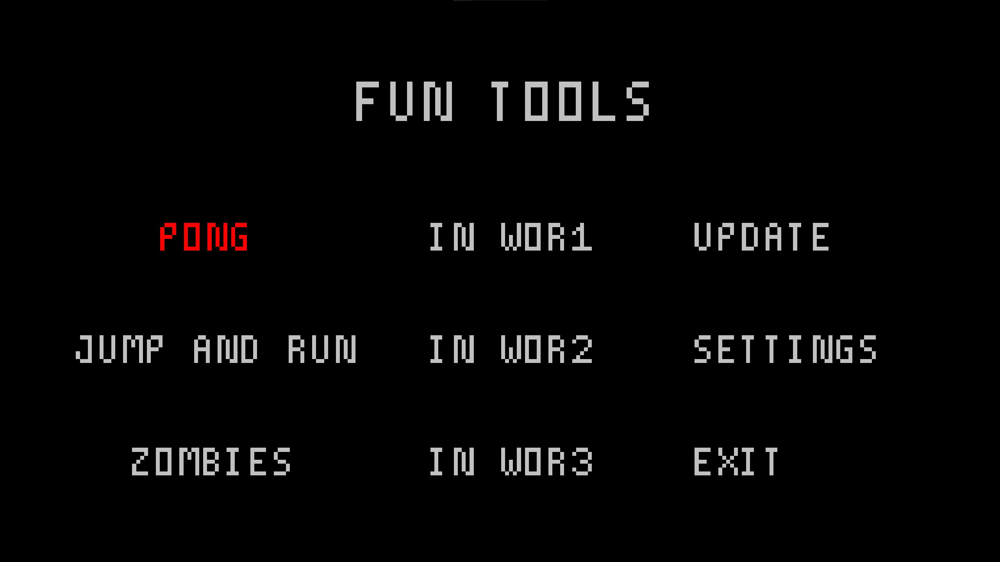

# FunTools

FunTools is an application that offers a variety of games, including pong, jump-and-run, and a thrilling zombies survival game. With in-app updates and customizable settings, you're sure to have a fun and engaging gaming experience.

## Features

- In-game updates
- Customizable settings
- Three exciting games: Pong, Jump-and-Run, and Zombies Survival

## How to Download

To download FunTools, go to the "Releases" section of this repository and select the version you want to install. Once you've selected the version, you'll find the .exe file that you need to download and install on your computer.

## Notice

To avoid viruses or other harmful software, it's recommended that you only download FunTools from this repository.

## License

FunTools is licensed under the GNU General Public License. You can find more information about the license [here](https://github.com/darrenefecto/FunTools/blob/master/LICENSE).

## Related Projects or Ideas

If you're interested in similar projects or ideas, check out the work of my friend [Abdul4968](https://github.com/Abdul4968), who had the same idea as me and created their own project. You can find their project at [here](https://github.com/Abdul4968/Hub).

## Screenshots

